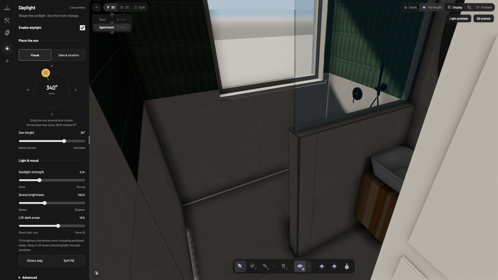

# Daylight for Pascal

**Move the sun. See where the light lands. Save the result.**

A small, offline plugin for exploring sun direction and direct shadows in Pascal.
Use a visual compass and sliders, or calculate the sun position from a date and location.
Keep useful settings as portable presets.

[Watch the demo](https://github.com/BlackforestDude/pascal-daylight-plugin/releases/download/v0.1.0-rc.6/Daylight-demo.mp4) ·
[Download the review release](https://github.com/BlackforestDude/pascal-daylight-plugin/releases/tag/v0.1.0-rc.6) ·
[Host integration](docs/INTEGRATION.md) ·
[Report an issue](https://github.com/BlackforestDude/pascal-daylight-plugin/issues)



Independent Apache-2.0 project by [BlackforestDude](https://github.com/BlackforestDude).
**Release candidate: host integration required.** Pascal must bundle the plugin before it
appears in that host's plugin list. This repository does not install it into Pascal's official
cloud editor, and no official endorsement or catalog acceptance is claimed.

## Capabilities

- Drag or tap a sun compass, with keyboard support and live sliders for height and light balance.
- Native date/time picking in the device time zone; offline solar calculations using SunCalc 2.0.2.
- Exact numeric values in Advanced, with preset file download/upload and optional JSON tools.
- Direct sunlight, exposure, and separately labelled unoccluded presentation fill.
- Strict version-1 JSON preset validation, export and import.
- Per-viewer atmosphere ownership, competing-atmosphere detection, and cleanup on uninstall.
- Warnings for incompatible display settings without modifying the model or host preferences.

This is raster sunlight. It does not simulate bounced light, photometric lux, coloured
transmission or caustics. A roofless scene is a presentation view, not an enclosed-room test.

Date and location calculate **the sun's direction and height**. Sunlight strength stays at your
chosen value while the sun is above the horizon and switches off below it. There is no live
weather, automatic seasonal intensity or sky-light simulation. Presentation fill is an artistic
control that brightens enclosed areas too.

## See it in use

The demo records the actual release candidate in a local Pascal host, including bathroom and
living-room details from an existing apartment. It shows the compass, sun-height slider,
direct-only versus fill, summer/winter sun positions, and preset download.

The host includes the separately reviewed enclosure/glazing shadow corrections. The video is
not evidence of hosted-cloud availability or calibrated lighting. See the
[recording notes](docs/DEMO.md) for settings and scope. No apartment graph or model files are
included in this repository.

## Use in a project

A Pascal host must bundle the package first. Open **Plugins → Daylight → Install**,
then enable Daylight in its panel. Disable any competing atmosphere through its own panel.
Start in **Visual**: drag the sun, set its height, then adjust **Sunlight strength** or
**Scene brightness**. **Lift dark areas** is an artistic fill; use **Direct only** for enclosure
checks. Compass arrow keys move 1° (Shift or Page keys: 15°); Home points north.

Choose **Date & location** for an actual sun position. Enter your project's latitude/longitude,
then use the date picker. Its time zone is your device's, shown below the field; it does not
infer the project's time zone from coordinates. Shared presets retain the same absolute moment.
Invalid dates and daylight-saving gaps/repeated times are rejected; an explicit offset in
**Advanced** resolves repeated times. **Use current time** updates only the timestamp.

**Advanced** contains exact values, model north alignment and preset files. Expand its JSON
section for copy/paste or developer/AI workflows. Both interfaces use the same version-1
configuration API. Sun colour remains the renderer's fixed warm white; no colour picker is
presented for a setting the plugin does not expose.

Uninstalling Daylight releases its presentation; it does not delete or rewrite authored nodes.

For enclosure checks use shadows on, Rendered shading, full-height walls, stacked levels,
visible roof/ceiling and zero presentation fill. Fast preview bypasses post-processing.

See [host integration](docs/INTEGRATION.md) for bootstrap, saved settings and public-viewer
requirements. [Compatibility](docs/COMPATIBILITY.md) separates the plugin API from the
companion rendering fixes. No ZIP or npm upload installs a plugin into Pascal's official cloud.

## Reproduce

Use Bun 1.3.13, Git and tar. No install-time scripts are required.

```sh
git clone https://github.com/BlackforestDude/pascal-daylight-plugin.git
cd pascal-daylight-plugin
git checkout v0.1.0-rc.6
bun install --frozen-lockfile --ignore-scripts
bun run check
bun run release
```

The release command requires a clean Git commit. It exports that source, performs two isolated
clean installs/checks/builds, packs both, and fails if the package bytes differ. It also installs
the resulting archive into a clean consumer, checks the exported API and writes checksums,
source revision, file inventory and command logs under `release/`. It never publishes.
See [release procedure](docs/RELEASING.md).

The release tag points to the exact qualified source. `main` may contain newer documentation
and demonstration media. The release assets include the original review packet, package,
checksums and source/host revisions; the packet's preparation-time report remains unchanged.

## Visual verification

The synthetic 3 × 4 m room contains no customer files or downloaded models. Its optional
test harness reads the explicitly selected Pascal source checkout; production plugin code
imports only public packages.

```sh
PASCAL_EDITOR_ROOT=/absolute/path/to/reviewed/pascal-editor bun run dev:lab
```

Run enclosure, native-glazing and lifecycle checks in the lab. Repeat with `?backend=webgl`.
Do not interpret geometry/texture counters as a complete GPU-memory measurement.
The browser harness also compares Three's complete reported GPU allocation counters after
20 warm remounts. [Testing instructions](docs/TESTING.md) cover both renderer backends and
the integrated editor. See the review packet's verification report for observed results
and remaining host acceptance.

## Data and external services

Runtime network requests, accounts, API keys, telemetry, geolocation requests, cookies and
plugin-owned local storage: none. Coordinates and timestamps are manually supplied settings.
Hosts choose where to persist the versioned preset; the stock local host uses browser storage.
Shared viewers need host-owned project persistence and the same display preferences.
GitHub publisher/documentation links are opened only when a user follows them.

## Identity and distribution

Plugin ID: `blackforestdude:daylight`. The earlier private candidate used `local:daylight`;
enable the new ID explicitly. Version-1 exported presets remain importable. No automatic
scene migration or public namespace registration is claimed.

Licensed under [Apache 2.0](LICENSE), with attribution in [NOTICE](NOTICE).
The package keeps `private: true` solely to prevent accidental npm publication; its release
archive is installable by a reviewed host. GitHub distribution does not require npm publication.
Use [GitHub Issues](https://github.com/BlackforestDude/pascal-daylight-plugin/issues) for bugs
and focused improvements. For rendering issues, include the plugin version, Pascal host
revision, browser, renderer backend and a small reproducible example without private project
data. Third-party terms are in [THIRD-PARTY-NOTICES.md](THIRD-PARTY-NOTICES.md).
